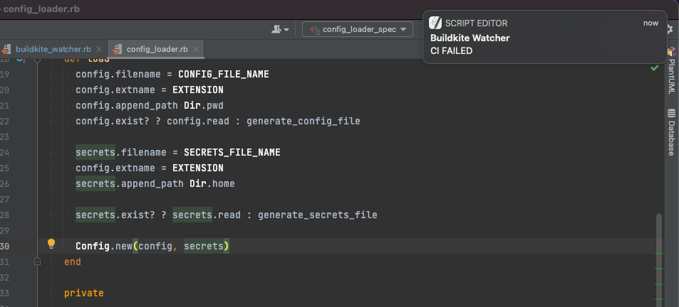

# Buildkite Watcher

It continuously watches the most recent buildkite job running the current git branch and notifies on build status changes.

## Installation

Run this command:

    gem install buildkite_watcher

## Usage

From your project's root directory, run:

    bw

## Development

After checking out the repo, run `bin/setup` to install dependencies. Then, run `rake` to run the tests. You can also run `bin/console` for an interactive prompt that will allow you to experiment.

To install this gem onto your local machine, run `bundle exec rake install`. To release a new version, update the version number in `version.rb`, and then run `bundle exec rake release`, which will create a git tag for the version, push git commits and the created tag, and push the `.gem` file to [rubygems.org](https://rubygems.org).

## Contributing

Bug reports and pull requests are welcome on GitHub at https://github.com/nulogy/buildkite_watcher.
