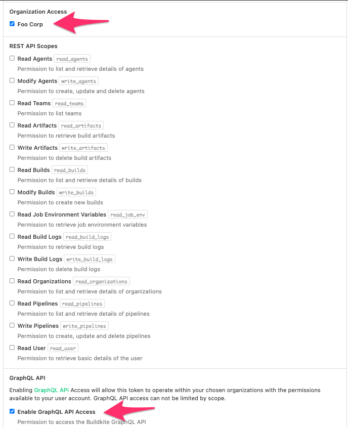

# How to create the API Access Token in Buildkite

1. Go to [the New API Access Token page](https://buildkite.com/user/api-access-tokens/new) in Buildkite
1. Add a description (e.g. buildkite_watcher)
1. In "Organization Access", check the organization the pipeline is in.
1. Check "Enable GraphQL API Access"
1. Click "Create New API Access Token"
1. Copy the new token

Example:

